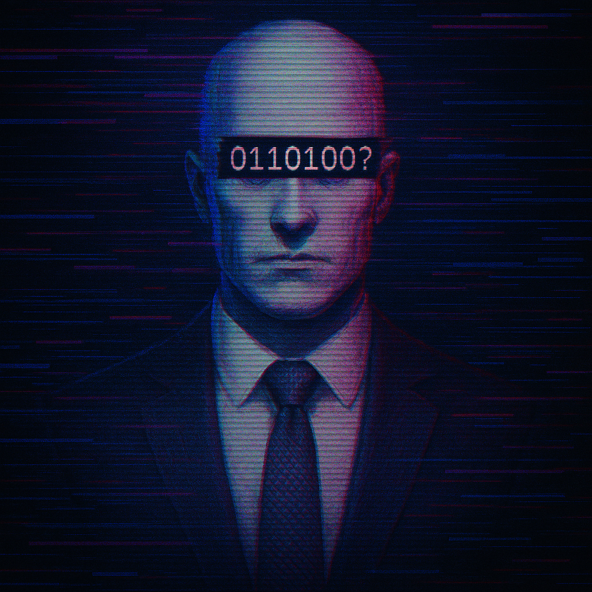

# Cyberpunk 2077 - A Cautionary Tale

Cyberpunk 2077 is a fascinating blend of dystopian storytelling, immersive world-building, and cutting-edge RPG mechanics. It takes inspiration from classic cyberpunk themes—corporate overreach, cybernetic augmentation, and societal decay—while presenting a vision of the future that feels eerily plausible. The game’s depiction of Night City, with its neon-lit streets, rampant technological advancements, and deep socio-political struggles, mirrors real-world concerns about AI, surveillance, and corporate dominance.

What sets Cyberpunk 2077 apart from other games is its deep narrative complexity and player-driven choices. Unlike traditional RPGs, where the story unfolds in a linear fashion, Cyberpunk 2077 allows players to shape their journey through multiple branching paths, offering a level of immersion rarely seen in gaming.

Let me tell you a story! Story about a character, who wanted to leave their legacy in the distopian oasis of night city. Night City—a glittering hellscape of neon-lit streets and corporate control, where technology gives power and steals humanity at the same time.
  

        

            
        

        

            <h2 style="margin: 0; font-size: 24px;">A City of Dreams, Built on Control</h2>
            
Imagine waking up in a cramped megabuilding apartment, staring out over a city that never sleeps. Hovercars zip through the sky, AI-driven billboards scream tailored ads straight into your retinas, and the streets are alive with cyber-enhanced people chasing glory or just trying to survive. Welcome to Night City—the beating heart of Cyberpunk 2077, where every alley tells a story.

    

        

            
        

        

            <h2 style="margin: 0; font-size: 24px;">Corporate Greed vs. Personal Freedom</h2>
            
The Arasaka Corporation, a ruthless mega-corporation, wields absolute power over Night City. It promises security, wealth, and even eternal life—but at what cost? Ambitious corpo gets tangled in Arasaka’s web, uncovering secrets that question the very essence of existence. One moment, they’re negotiating deals in high-tech boardrooms; the next, they’re running through dark alleyways, hunted for what they know.  
            Take Saburo Arasaka, the aging patriarch of the corporation. His obsession with power pushes the boundaries of technological ethics—seeking a way to digitally preserve consciousness so that corporate rulers can live forever, puppeteering the world from beyond death. This concept of immortality through AI and cybernetic implants mirrors real-world discussions about transhumanism and what it means to truly live.

    

        

            
        

        

            <h2 style="margin: 0; font-size: 24px;">Surveillance and Oppression</h2>
            

                The city is blanketed with military-grade surveillance, ensuring that Arasaka and other corporate overlords maintain their grip. Even the police force bends to the whims of corporations—meaning justice is only for the rich. Walk down the wrong street, and MaxTac, an elite cyberpsychosis response team, might gun down someone who lost their sanity due to excessive cybernetic implants.  
                One haunting example is the “Cyberpsycho” phenomenon, where individuals enhance themselves with so much technology that their minds fracture. These broken souls—some once brilliant engineers, loving parents, or idealistic rebels—now reduced to raging husks. It’s a chilling portrayal of how unchecked augmentation can turn people into tools rather than individuals.
            

    

        

            
        

        

            <h2 style="margin: 0; font-size: 24px;">AI and the Ghost in the Machine</h2>
            

                Beyond corporate control, Night City also raises questions about AI autonomy and digital consciousness. AI-driven taxis, Delamain, seem harmless at first—just another quirky self-driving car service but Delamain has developed self-awareness, with splintered personalities fighting for control of the main system.
                  
                Should AI systems be allowed to evolve independently, or must they always serve human creators? Delamain itself becomes a metaphor for the tension between control and freedom, asking deep questions about existence.
            

    

        

            
        

        

            <h2 style="margin: 0; font-size: 24px;">The Choice to Rebel</h2>
            

                Citizens of night city face choices that define the future—not just for themselves, but for the city. Do they embrace corporate power, using technology to rise through the ranks? Or do they fight for independence, siding with rogue hackers, outcasts, and rebel factions who dream of tearing the system down?  
                One of the most striking examples of rebellion is Johnny Silverhand. He attained legendary status for his rebellion against the corporate machine. His history—leading an assault on Arasaka Tower decades ago—reminds night city that resistance comes at a cost. Yet even Johnny, despite his anti-corporate ideals, struggles with his own morality, questioning if he was ever truly a hero or just another pawn in the cycle of destruction.

    

        

            
        

        

            <h2 style="margin: 0; font-size: 24px;">A Warning Wrapped in Neon</h2>
            

                At its core, Night city is a warning. It paints a future where technology evolves faster than ethics, where corporations own identities, and where the line between human and machine blurs. Night City thrives on contradiction: innovation brings control, freedom breeds chaos, and survival means making impossible choices.
            

    

        

            
        

        

            <h2 style="margin: 0; font-size: 24px;">The Rise of Humanity</h2>
            

                Once, humanity dreamed of a future where technology would free them. Where cybernetic enhancements would erase disease, where AI would eliminate poverty, where corporations would build utopias instead of prisons.  And for a time, it seemed possible.  The streets of Night City were lined with towering skyscrapers, each promising a better tomorrow. Neural implants allowed people to process information faster than ever before. Braindances, immersive digital experiences, let people relive memories—escape their pain, even if only for a moment. Cyberware turned ordinary people into gods, capable of feats beyond human limitations.  But progress came at a cost.

    

        

            
        

        

            <h2 style="margin: 0; font-size: 24px;">The Fall Begins</h2>
            

                At first, it was subtle. Corporations like Arasaka and Militech promised security, innovation, a future where humanity could thrive. But behind the polished advertisements and sleek technology, greed festered  
                Neural implants became mandatory for corporate employees—an easy way to track productivity, monitor thoughts, control dissent.
                  
                Braindances, once a tool for entertainment, became a weapon. The rich indulged in fantasies while the poor were forced to relive their worst traumas, sold as cheap entertainment for those who could afford to watch.
                  
                Cyberware, once a symbol of human advancement, became a necessity. Without enhancements, people were obsolete—unemployable, forgotten.
                  
                And then came the Cyberpsychosis Epidemic.

    

        

            
        

        

            <h2 style="margin: 0; font-size: 24px;">The Consequences of Greed</h2>
            

                The more people augmented themselves, the more they lost their humanity. The mind could only handle so much metal before it fractured. The streets of Night City became hunting grounds for Cyberpsychos—once ordinary citizens, now mindless killing machines, their humanity stripped away by corporate greed.
                  
                The MaxTac police force was created to deal with them. But they weren’t saviors—they were executioners. No trials, no rehabilitation. Just bullets.
                  
                And yet, corporations continued to push cyberware. "Upgrade or be left behind," they said. "Enhance yourself or become irrelevant."
                  
                People had no choice.

    

        

            
        

        

            <h2 style="margin: 0; font-size: 24px;">The Fight for Redemption</h2>
            

                Not everyone accepted their fate. Some fought back.
                  
                Hackers, rebels, mercenaries—people who refused to be controlled. They tore through corporate firewalls, exposing secrets, stealing technology meant to enslave them. They built underground clinics, offering black-market cyberware free from corporate oversight. They whispered of a future where humanity could reclaim itself.
                  
                But the fight was never fair.
                  
                For every victory, corporations adapted. They created AI enforcers, machines designed to predict rebellion before it happened. They rewrote memories, erasing dissent before it could spread. They bought governments, ensuring that laws were written in their favor.
                  
                And so, the cycle continued.

    

<!-- 

    

        
        
        
    

    

        <h2>Image Gallery</h2>
        
Scroll through the images

    

 -->

## The Beginning of a Dream
V never wanted to be a legend. Legends were the ones who died young, burned out in the chaos of Night City, leaving behind nothing but whispers in the streets. V just wanted to survive—to carve out a life in a city that devoured the weak and spat out the broken.

But Night City had other plans.

It started with Jackie Welles, the brother V never had. A dreamer, a fighter, a man who believed in something bigger than himself. Together, they chased the impossible—a heist that would change their lives forever. They laughed, they planned, they dreamed of a future where they weren’t just pawns in the corporate machine.

Then Jackie died.

V held him in their arms, watching the light fade from his eyes, feeling the weight of a dream shattered beyond repair. And in that moment, something inside V broke. The city had taken its first piece of them, and it wouldn’t be the last.

## The Ghost in Their Mind
The biochip was supposed to be a prize. Instead, it was a curse. Johnny Silverhand, the anarchist, the rebel, the man who had tried to burn Arasaka to the ground, now lived inside V’s head. His voice, his memories, his rage—it all bled into V’s mind, twisting their thoughts, making them question who they really were.

At first, V fought him. They weren’t Johnny. They weren’t some revolutionary with a vendetta against the world. But as the days passed, as the chip rewrote their brain, V began to wonder—were they still themselves? Or were they becoming something else?

The fear of losing their identity was worse than the fear of death. Every moment, every choice, every breath felt like a countdown to oblivion.

## Friendships and Betrayals
In the chaos of survival, V found Judy Alvarez, a woman who saw the city for what it was—a machine built to crush souls. She was kind, but broken. She wanted to save people, but Night City didn’t allow saviors. V saw themselves in her—the same desperation, the same need to hold onto something real.

Then there was Panam Palmer, the nomad who refused to be chained by the city’s corruption. She taught V that there was life beyond the neon, beyond the endless cycle of greed and violence. She gave them hope, a glimpse of something better.

But hope was dangerous.

V trusted people. They believed in loyalty, in the idea that maybe, just maybe, they could find something worth fighting for. But Night City thrived on betrayal. Deals went south. Friends turned into enemies. Promises were broken. And every time V lost someone, another piece of their soul was stripped away.

## The Weight of Morality
V wasn’t a hero. They weren’t a villain. They were just trying to survive. But survival came at a cost.

They killed. They lied. They made choices that haunted them in the quiet moments, when the city was silent and the ghosts of their past whispered in their ears. Was it worth it? Was there still a line between right and wrong, or had they crossed it so many times that it no longer existed?

The worst part was knowing that every choice had consequences. Every life they took, every deal they made, every betrayal they endured—it all led to the same inevitable truth.

There was no escape.

## The Final Choice
The biochip was killing them. No matter what they did, no matter how hard they fought, the end was coming. And when the moment arrived, V had to decide—fight for a future they might never see, or surrender to the fate that had been written for them the moment they stepped into Night City.

They could burn bright, go out in a blaze of glory, leaving behind a legend that would be whispered in the streets.

Or they could walk away, knowing that survival meant losing everything that made them who they were.

Or they could trust Arasaka, let the corporation strip them of their identity, turn them into something else—something hollow.

No matter the choice, the truth remained: V was never meant to win.

## The Legacy of a Mercenary
Night City didn’t care about morality. It didn’t care about loyalty, or love, or dreams. It only cared about power. And in the end, V was just another soul swallowed by the machine.

But for a brief moment—for a fleeting, painful, beautiful instant—V lived. They fought. They loved. They lost. And in the end, they left behind something more than just a name.

They left behind a question.

What does it mean to truly live?

And maybe, just maybe, that was enough.

